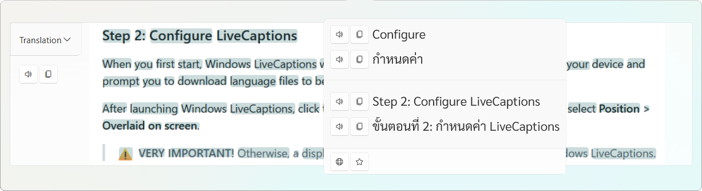
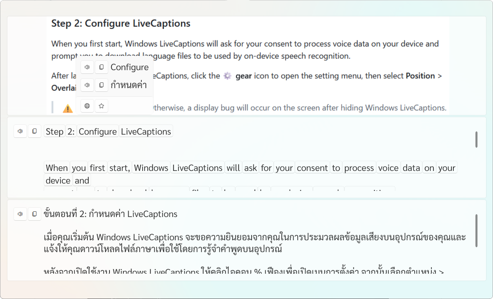

Hi, thanks for using ScreenLookup!
I'm developing this application with the goal of learning languages from within my VR headset desktop overlay. It will retrieve text from the screen, translate it, and learn how to pronounce it.<LineBreak />
If you find any errors or want to add new features, please report the issue on GitHub.

# What is Lookup?
Capture your screen to find the target language unknown word and translate it into your language make it easy for learning languages from movies and games.
Don't worry if you can't remember. ScreenLookup has a **history** system to get back to the previous screen captured, and a **saved word** system to make sure you don't miss a new word to learn.
And if you found the same word again, you can **want to learn** score to make the word appear at the top of the **saved page**.

# Getting Started
1. In the Settings page, change the Source Language and accuracy level, then press the download button to begin.
    * The higher the accuracy, the longer the screen scanning time will be for very large paragraphs.

2. Additionally, for spell correction (Hunspell), sometime recognization word from images is not perfect,t and Hunspell can fix that. You can download and enable Hunspell if the Source Language is supported.
    * Enabling Hunspell will make the Lookup process take longer for very large paragraphs.
3. Change the Target Language to your native language for translating and speaking, then change the Translation and Text-To-Speech Provider as you prefer.
4. Lookup Method means how the Lookup shows in the result window.
    * **On Image** - Place words on top of the image
      
    * **On Line** - Place all words into the box
      
5. Begin Lookup the Windows screen by pressing followed the Lookup Shortcut or click on the tray icon or select Lookup in tray right-click menu.
    * Lookup options can be seen at the bottom left corner of the screen after Lookup started.
    * Fullscreen window games might have an issue with Lookup; change to Window for Windows Borderless mode to fix.
    * Every Lookup paragraph will be saved to the History page.
    * Each word can be clicked to pop up a flyout for saving the word to the Saved page or learn the word's definition and pronunciation.

# Screenshot

