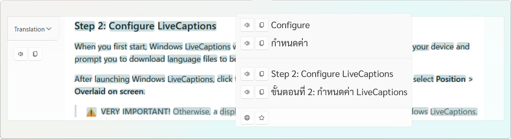
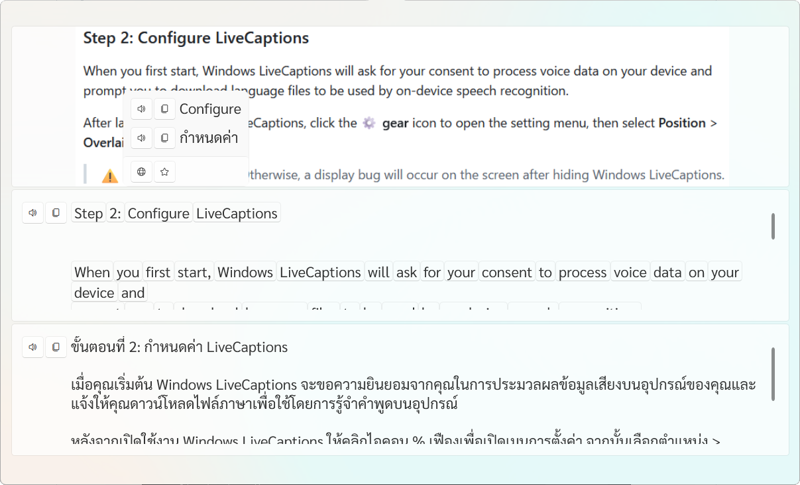

# ScreenLookup - Real-time Screen OCR, Translation & VR Language Learning Tool

ScreenLookup is a Windows desktop and SteamVR application designed for language learning from games, movies, and desktop applications. It extracts text from the screen using Tesseract OCR, translates it into your target language, provides dictionary alternative meanings/parts of speech, and speaks pronunciations with Text-To-Speech (TTS).

[Download Latest Release](https://github.com/chaixshot/ScreenLookup/releases)

## Features & Highlights

* **Desktop & VR Screen Capture**: Perform instant OCR on any selected desktop area or use 3D hand gestures in SteamVR (FrameShot) without removing your headset.
* **Rich Dictionary & Alternative Meanings**: Click any word to view primary translations plus parts of speech (`noun`, `verb`, `adjective`) and alternate meanings (Google Translate).
* **Tesseract OCR & Hunspell Correction**: High-accuracy optical character recognition with optional Hunspell dictionary spell-correction for stylized game fonts.
* **Text-To-Speech (TTS)**: Listen to native audio pronunciations for source words and translated sentences.
* **Dual Display Modes**:
  * **On Image**: Places interactive, clickable word boxes directly over the captured image.
  * **On Line**: Displays a clean, structured text list.
* **History & Vocabulary Management**:
  * **History**: Automatically records previous captures and translations.
  * **Saved Words**: Bookmark new vocabulary and track your review priority scores.
* **Multiple Translation Engines**: Switch between Google, Google New, Bing, Microsoft Azure, and Yandex.

## Prerequisites

* **OS**: Windows 10 / Windows 11 (64-bit)
* **Runtime**: [.NET 10 Desktop Runtime](https://dotnet.microsoft.com/)
* **VR Headset (Optional)**: SteamVR-compatible headset (Meta Quest via Link/VD, Valve Index, HTC Vive, etc.) for FrameShot VR features.

## Getting Started

1. **Configure Languages & Download Models**:
   * Open the **Settings** page.
   * Select your **Source Language** and accuracy level, then click **Download** to acquire Tesseract OCR model data.
   * *(Optional)* Download **Hunspell** for spell correction if supported by your source language to fix game font OCR artifacts.
   * Select your **Target Language**, **Translation Provider**, and **TTS Provider**.

2. **Choose Lookup Display Method**:
   * **On Image**: Overlays interactive text blocks directly over the screenshot.
     
   * **On Line**: Places all words neatly into a text box.
     

3. **Perform Desktop Lookup**:
   * Press your configured **Global Hotkey**, click the **System Tray Icon**, or use the tray right-click menu.
   * Click any word in the result window to open the **Word Flyout** for dictionary definitions, alternative meanings, audio playback, and saving vocabulary.

## FrameShot (VR Support)

ScreenLookup includes native **SteamVR / OpenVR** integration allowing you to capture, crop, and read translations inside VR games using intuitive controller hand gestures.

### SteamVR Setup

* Connect directly to **SteamVR** from the **FrameShot** page, or enable **Auto Connect**.
* Select **Render Eye Side** (`Left Eye` or `Right Eye`) for projection rendering.

### VR Gestures & Controls

1. **Bring Controllers Together**: Move both VR controllers close to each other within the `Activation Radius`.
1. **Start Framing**: Press and hold the **Grip** buttons on both controllers.
1. **Define Frame**: Pull your hands apart to stretch the 3D capture box in VR space.
1. **Capture**: Release the **Right Grip** to capture the framed area (release **Left Grip** to cancel).
   * *Option Mode*: Hold **Trigger** and release **Right Grip** to enter option mode.
1. **Overlay Controls**: Pointer at the overlay then:
   * Press **A / X** once on the VR controller to close the overlay.
   * Press **A / X** twice to recenter the overlay in front of your headset.

### VR Overlay Customization

* **Appearance**: Adjust `Overlay Height`, `Distance`, `Scale`, `Scroll Speed`, and `Curve` (0–100%).
* **HMD Rotation**: Optionally tilt the capture frame with head movement (`Use HMD Rotations` and threshold sensitivity).

## Saved Words

The **Saved Words** allows you to build, review, and manage your personal vocabulary list saved during screen lookups.

* **Word Dictionary Flyout**: Click any word in the **Original** column to pop up the **Word Flyout** for alternative dictionary meanings.
* **Priority Ranking ("Want To Learn")**: Sort words by priority score (`Want To Learn`) or addition date (`Added Time`). Incrementing a word's score moves it to the top of your review queue when encountered repeatedly.
* **Audio Pronunciation**: Independent Text-To-Speech (TTS) speaker buttons for both source words and target translations.
* **Online Dictionary Lookup**: Click the browser button on any word entry to open external web dictionary searches.
* **Filtering & Real-Time Search**: Filter vocabulary entries by **Source Language** or use the instant search auto-suggest box.
* **Export Data**: Export your saved vocabulary list to CSV format for Anki/flashcard import or external study.

## Troubleshooting & Tips

### OCR Inaccuracies or Misread Fonts

* **Use Image Editing Toolbar**:
  * Use **Rotate Left / Rotate Right** if captured text is vertical or sideways.
  * Use **Zoom** to enlarge tiny or low-resolution text for clearer character recognition.
  * Click **Confirm** after adjusting to re-run Tesseract OCR on the modified image.
* Increase the **Source Language Accuracy** level in Settings.
* Enable **Hunspell** for supported languages to correct OCR misspellings automatically.

### Fullscreen Game Capture Issues

* If the captured screen is black or frozen, switch the game from *Exclusive Fullscreen* to *Windowed* or *Borderless Windowed* mode.

## Screenshots

---

## Credits

* **[Tesseract OCR](https://github.com/charlesw/tesseract)**: Optical Character Recognition engine for text extraction.
* **[HunspellSharp](https://github.com/Tomi-A/HunspellSharp)**: Spell checking and dictionary correction engine.
* **[GTranslate](https://github.com/Hexed2/GTranslate)**: Multi-provider translation and Text-To-Speech library.
* **[WPF-UI](https://github.com/lepoco/wpfui)**: Modern Fluent UI design system and Mica backdrop controls.
* **[NAudio](https://github.com/naudio/NAudio)**: Audio rendering library for dynamic audio output routing.
* **[Vortice.Windows](https://github.com/amerkoleci/Vortice.Windows)**: DirectX 11 wrappers for desktop frame capturing.
* **[OpenVR](https://github.com/ValveSoftware/openvr)**: Valve OpenVR SDK for SteamVR 3D controller tracking and overlays.
* **[HotkeyUtility](https://github.com/iPylum/HotkeyUtility)**: Global hotkey management library.
* **[WpfScreenHelper](https://github.com/micdenny/WpfScreenHelper)**: Multi-monitor display helper for WPF.
